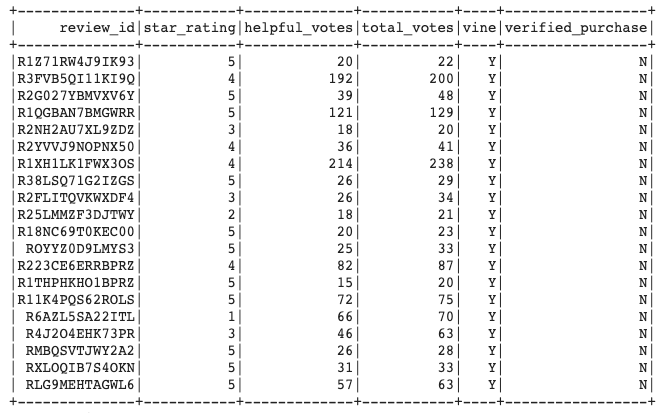
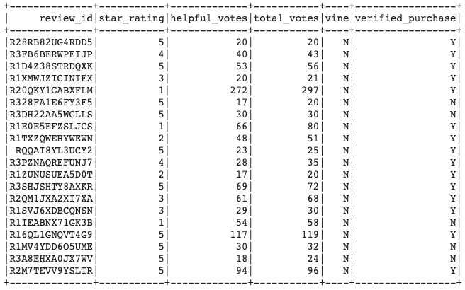

# Amazon Vine Analysis

## Overview of the Analysis

In this analysis, we chose a single dataset of reviews from a specific product on Amazon. We then used the dataset to determine if members of the Amazon Vine program (customers who are paid for their reviews) show any bias toward favorable reviews when compared with unpaid Amazon reviewers. In our case, we chose to analyze kitchen product reviews.

## Results

Here are snapshots of our Vine (paid) reviews and unpaid reviews DataFrames, respectively:

- There were 1,207 Vine reviews and 97,839 unpaid reviews on kitchen products.
- There were 509 Vine 5-star reviews and 45,858 unpaid 5-star reviews on kitchen products.
- 42.17% of the Vine reviews were 5-star and 46.87% of the unpaid reviews were 5-star.

## Summary

According to our results, there is no positivity bias for reviews given by customers in the Vine program. In our case, 42.17% of the Vine reviews were 5-star, compared to 46.87% of the unpaid reviews being 5-star. When it comes to kitchen products, unpaid reviewers are slightly more likely to give 5-star reviews than Vine reviewers.

Another analysis that we could perform with our dataset to support this statement could be to look more closely at Vine and unpaid reviews with a higher number of helpful votes. These reviewers could be considered more credible or popular than reviewers whose review has a lower number of helpful votes. We could perform a similar analysis where we filter for 5-star reviews with over 50 helpful votes, for example, to discover if the lack of positivity bias in Vine reviewers remains.